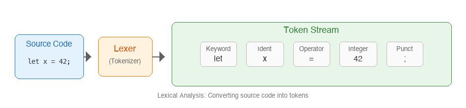
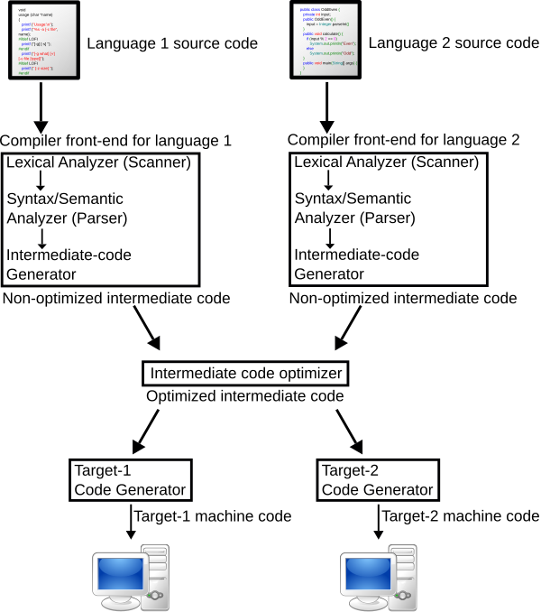
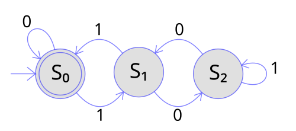

# Lex

This project is my own implementation of a lexer/tokenizer. It's built from scratch, using only theory as reference.

## Goals

The following are the things I want to learn from doing this project:

- [x] How to design and implement a lexical analysis algorithm
- [x] How to handle different token types and lexical rules
- [x] How to efficiently scan and categorize input streams
- [x] Figure out how to adapt the ASCII-only ideas in the textbooks I read to work with the full Unicode range<sup>1</sup>

And the following are goals I have for my implementation:

- [x] Write everything by hand and from scratch
- [x] Handle Unicode, not just ASCII<sup>1</sup>
- [x] Handle the following token types:
  - [x] Keywords - reserved words like `if`, `else`, `while`, `fn`
  - [x] Identifiers - variable and function names (including Unicode identifiers)
  - [x] Literals - numbers, strings, characters, booleans
  - [x] Operators - arithmetic, logical, comparison operators
  - [x] Delimiters - parentheses, braces, brackets, semicolons
  - [x] Comments - single-line (`//`) and multi-line (`/* */`)
- [x] Provide detailed token position information (line and column numbers)
- [x] Output tokens in a structured format for easy debugging
- [x] Support pluggable lexical rules for different programming languages

## Screenshots

Example token stream output for input `let x = 42;`:

```
$ lex --code "let x = 42;"
Keyword(let)         "let"
Ident                "x"
=                    "="
IntLiteral           "42"
;                    ";"
```

With verbose position information:

```
$ lex --code "fn main() { let 日本語 = 42; }" --verbose
Keyword(fn)          "fn" (1:1 - 1:3)
Ident                "main" (1:4 - 1:8)
(                    "(" (1:8 - 1:9)
)                    ")" (1:9 - 1:10)
{                    "{" (1:11 - 1:12)
Keyword(let)         "let" (1:13 - 1:16)
Ident                "日本語" (1:17 - 1:20)
=                    "=" (1:21 - 1:22)
IntLiteral           "42" (1:23 - 1:25)
;                    ";" (1:25 - 1:26)
}                    "}" (1:27 - 1:28)
```

JSON output:

```
$ lex --code "let x = 42;" --output json
[
  { "kind": "Keyword(let)", "lexeme": "let", "line": 1, "column": 1 },
  { "kind": "Ident", "lexeme": "x", "line": 1, "column": 5 },
  { "kind": "=", "lexeme": "=", "line": 1, "column": 7 },
  { "kind": "IntLiteral", "lexeme": "42", "line": 1, "column": 9 },
  { "kind": ";", "lexeme": ";", "line": 1, "column": 11 }
]
```

## How It Works

### Lexical Analysis

Lexical analysis (also called tokenization or scanning) is the first phase of a compiler. It takes raw source code as a stream of characters and converts it into a stream of tokens.



The lexer reads the input character by character, grouping them into meaningful units called tokens. Each token has a type (keyword, identifier, operator, etc.) and the original text (lexeme).

#### Compiler Pipeline

The lexer is the first phase in the compiler pipeline, feeding tokens to the parser:



*Compiler structure diagram. Source: [Wikimedia Commons](https://commons.wikimedia.org/wiki/File:Compiler.svg), by Surachit, [CC BY-SA 2.5](https://creativecommons.org/licenses/by-sa/2.5/).*

### Finite Automata

The lexer uses concepts from finite automata theory to recognize tokens. Each token type can be described by a pattern that a finite state machine can recognize.



*A DFA that recognizes binary strings divisible by 3. Source: [Wikimedia Commons](https://commons.wikimedia.org/wiki/File:DFA_example_multiplies_of_3.svg), [CC BY-SA 3.0](https://creativecommons.org/licenses/by-sa/3.0/).*

### Maximal Munch

The lexer uses the "maximal munch" (or "longest match") principle: when multiple token patterns could match at the current position, the lexer chooses the longest possible match. This is why `==` is recognized as a single equality operator, not two assignment operators.

## Usage

### As a Library

```rust
use lex::{Lexer, DefaultLanguage};

let source = "let x = 42;";
let (tokens, errors) = Lexer::tokenize(source, DefaultLanguage);

for token in &tokens {
    println!("{:?}", token);
}
```

### Custom Languages

```rust
use lex::language::{LanguageBuilder, LanguageSpec};
use lex::token::TokenKind;
use lex::Lexer;

let python_like = LanguageBuilder::new()
    .keywords(&["def", "if", "else", "while", "for", "return", "True", "False", "None"])
    .operator("==", TokenKind::EqEq)
    .operator("!=", TokenKind::BangEq)
    .single_line_comment("#")
    .string_delimiters(&['"', '\''])
    .build();

let (tokens, errors) = Lexer::tokenize("def hello(): return 42", python_like);
```

### CLI Tool

```
Usage: lex [OPTIONS] <FILE>
       lex --code "<CODE>"

Options:
  -c, --code <CODE>    Tokenize inline code
  -o, --output <FMT>   Output format: pretty, json, debug
  -v, --verbose        Show detailed position information
  -h, --help           Show help message
```

## References

These are the resources I used to learn about lexical analysis and tokenization:

- [Compilers: Principles, Techniques, and Tools (Dragon Book)](https://en.wikipedia.org/wiki/Compilers:_Principles,_Techniques,_and_Tools)
  - Chapter 3: Lexical Analysis
- [Crafting Interpreters](https://craftinginterpreters.com/) by Robert Nystrom
  - Chapter 4: Scanning
- [Engineering a Compiler](https://www.elsevier.com/books/engineering-a-compiler/cooper/978-0-12-815412-0) by Cooper and Torczon
  - Chapter 2: Scanners

## Footnotes

<sup>1</sup> Many lexer implementations focus on ASCII input for simplicity. Modern programming languages use Unicode, so this implementation handles the full Unicode range by treating input as UTF-8 and properly handling multi-byte character sequences. This allows for Unicode identifiers (like `日本語` or `αβγ`) and string literals while maintaining efficient scanning performance. The implementation follows [UAX #31](https://www.unicode.org/reports/tr31/) for Unicode identifier rules.
